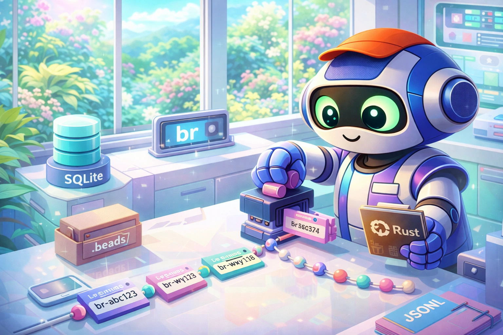

# beads-polis

<div align="center">
  
</div>

<div align="center">

[](./system/LICENSE)
[](https://www.rust-lang.org/)
[](https://www.sqlite.org/)

</div>

---

`br` is a local-first issue tracker that lives inside your git repo. It stores issues in SQLite for fast queries and exports them to JSONL for git-friendly collaboration. It never runs git commands, never installs hooks, never touches your source code. You tell it what to track, you tell it when to sync, you commit the results yourself.

This is the Polis fork. The original [beads_rust](https://github.com/Dicklesworthstone/beads_rust) by Jeffrey Emanuel was built for single-user agent workflows. Polis runs multiple agents writing to the same database concurrently, and the upstream locking was a no-op. This fork adds real POSIX advisory locking (`flock`) so concurrent writers block instead of corrupting. One focused fix; everything else tracks upstream.

---

## Current Status

| Area | Status | Notes |
|------|--------|-------|
| Core CLI (`br create/close/list/ready/sync/...`) | ✅ Working | All upstream commands functional. v0.1.19. |
| POSIX flock for concurrent writers | ✅ Working | Agents serialize on `.beads/beads.lock` via `fs2`. |
| Test suite | ✅ 2,100+ tests | 785+ lib, 1,300+ integration, 8 Polis-specific concurrency tests. |
| Self-update (`br upgrade`) | ⚠️ Points to upstream | Pulls binaries from upstream repo, not this fork. Build from source for Polis. |
| Background daemon | ⚠️ Not implemented | `--no-daemon` is a no-op in v1. Writers serialize via flock instead. |
| Multi-agent attribution under concurrency | ⚠️ Untested | Concurrent mutations work, but agent-identity audit trails haven't been verified under contention. |
| Cross-repo sync contention | ⚠️ Untested | Two agents syncing simultaneously is not covered by tests. |

---

## Upstream

- **Upstream project:** `beads_rust`
- **Upstream author:** Jeffrey Emanuel (`Dicklesworthstone`)
- **Upstream repo:** https://github.com/Dicklesworthstone/beads_rust

Fork rationale and divergence notes are tracked in [FORK.md](FORK.md).

## Why This Project Exists

Jeffrey Emanuel built `beads_rust` as a Rust port of Steve Yegge's [beads](https://github.com/steveyegge/beads), freezing the "classic" SQLite + JSONL architecture around which he built his Agent Flywheel tooling. It's ~20K lines of Rust focused on one thing: tracking issues without getting in your way.

**br** solves the gap between heavyweight external trackers (Jira, Linear) and throwaway TODO comments:

| Feature | br | GitHub Issues | Jira | TODO comments |
|---------|-----|---------------|------|---------------|
| Works offline | **Yes** | No | No | Yes |
| Lives in repo | **Yes** | No | No | Yes |
| Tracks dependencies | **Yes** | Limited | Yes | No |
| Zero cost | **Yes** | Free tier | No | Yes |
| No account required | **Yes** | No | No | Yes |
| Machine-readable | **Yes** (`--json`) | API only | API only | No |
| Git-friendly sync | **Yes** (JSONL) | N/A | N/A | N/A |
| Non-invasive | **Yes** | N/A | N/A | Yes |
| AI agent integration | **Yes** | Limited | Limited | No |

---

## Repo Layout

- `system/` — active Rust project (`br` CLI), tests, packaging, docs
- `FORK.md` — fork policy and divergence log
- `TESTING.md` — Polis testing notes and rubric audit
- `polis/` — reserved for Polis-specific overlays (currently minimal)

## Build and Test

```bash
cd system
cargo build
cargo test
```

Run the CLI locally:

```bash
cd system
./target/debug/br --help
```

Run just the Polis-specific concurrency tests:

```bash
cd system
cargo test --test storage_concurrent flock
cargo test --test e2e_concurrency
cargo test --test e2e_claim_atomic
```

---

## Using `br` in Polis

Typical workflow:

```bash
br ready
br create "Title" -p 1 -t task -l <project>
br close <id> --reason "what changed"
br sync --flush-only
```

`br` is non-invasive: it does not run git commands for you.
After sync, commit `.beads/` changes explicitly.

---

## Quick Start

### 1. Initialize in Your Project

```bash
cd my-project
br init
# Initialized beads workspace in .beads/
```

### 2. Create Your First Issue

```bash
br create "Fix login timeout bug" \
  --type bug \
  --priority 1 \
  --description "Users report login times out after 30 seconds"
# Created: bd-a1b2c3
```

### 3. Check Ready Work

```bash
br ready
# Shows issues that are open, not blocked, not deferred
```

### 4. Claim and Work

```bash
br update bd-a1b2c3 --status in_progress --assignee "$(git config user.email)"
```

### 5. Close When Done

```bash
br close bd-a1b2c3 --reason "Increased timeout to 60s, added retry logic"
```

### 6. Sync to Git

```bash
br sync --flush-only        # Export DB to JSONL
git add .beads/             # Stage changes
git commit -m "Fix: login timeout (bd-a1b2c3)"
```

---

## Design Philosophy

### Non-Invasive by Default

br **never** touches your source code or runs git commands automatically. It only writes to `.beads/`.

```bash
ls -la .beads/
# beads.db       # SQLite database
# issues.jsonl   # Git-friendly export
# config.yaml    # Optional config
```

### SQLite + JSONL Hybrid

**SQLite** for fast local queries. **JSONL** for git-friendly collaboration.

```bash
# Local: Fast queries via SQLite
br list --priority 0-1 --status open --assignee alice

# Collaboration: JSONL merges cleanly in git
git diff .beads/issues.jsonl
```

### Explicit Over Implicit

Every operation is explicit. No magic, no surprises.

```bash
br sync --flush-only     # Export is explicit
br sync --import-only    # Import is explicit
git add .beads/ && git commit -m "..."  # Git is YOUR responsibility
```

### Agent-First Design

Every command supports `--json` for AI coding agents:

```bash
br list --json | jq '.[] | select(.priority <= 1)'
br ready --json
br show bd-abc123 --json
br schema all --format json | jq '.schemas.Issue'
```

See [AGENTS.md](system/AGENTS.md) for the complete agent integration guide.

---

## Architecture

```
┌──────────────────────────────────────────────────────────────┐
│                         CLI (br)                              │
│  Commands: create, list, ready, close, sync, etc.            │
└──────────────────────────────────────────────────────────────┘
                              │
                              ▼
┌──────────────────────────────────────────────────────────────┐
│                      Storage Layer                            │
│  ┌─────────────────┐              ┌─────────────────────┐    │
│  │  SqliteStorage  │◄────────────►│  JSONL Export/Import │    │
│  │                 │   sync       │                     │    │
│  │  - WAL mode     │              │  - Atomic writes    │    │
│  │  - Dirty track  │              │  - Content hashing  │    │
│  │  - Blocked cache│              │  - Merge support    │    │
│  │  - flock (Polis)│              │                     │    │
│  └────────┬────────┘              └──────────┬──────────┘    │
└───────────│──────────────────────────────────│───────────────┘
            │                                  │
            ▼                                  ▼
     .beads/beads.db                    .beads/issues.jsonl
     (Primary storage)                  (Git-friendly export)
```

---

## `br` CLI Reference

### Global Flags

These flags apply to every `br` command.

| Flag | Type | Description |
|---|---|---|
| `--db <PATH>` | path | Database path override; otherwise auto-discovers from `.beads` metadata. |
| `--actor <NAME>` | string | Actor name used in audit/event trails. |
| `--json` | bool | Force JSON output mode. |
| `--no-daemon` | bool | Force direct mode; currently a no-op in v1. |
| `--no-auto-flush` | bool | Skip automatic post-mutation JSONL export. |
| `--no-auto-import` | bool | Skip pre-command stale-import check. |
| `--allow-stale` | bool | Allow stale DB when auto-import detects newer JSONL. |
| `--lock-timeout <MS>` | u64 | SQLite busy timeout in milliseconds. |
| `--no-db` | bool | JSONL-only mode; uses in-memory DB loaded from JSONL. |
| `-v`, `--verbose` | count | Increase log verbosity (`-v`, `-vv`, etc.). |
| `-q`, `--quiet` | bool | Minimal output (errors only). |
| `--no-color` | bool | Disable colored output. |

### Shared List/Filter Flags

These flags are available on `list`, `search`, `query save`, and `query run`.

| Flag | Type | Description |
|---|---|---|
| `--status`, `-s <STATUS>` | repeat | Filter by status (repeatable). |
| `--type`, `-t <TYPE>` | repeat | Filter by issue type (repeatable). |
| `--assignee <NAME>` | string | Filter by assignee. |
| `--unassigned` | bool | Filter to unassigned issues. |
| `--id <ID>` | repeat | Filter to specific IDs. |
| `--label`, `-l <LABEL>` | repeat | AND-label filter. |
| `--label-any <LABEL>` | repeat | OR-label filter. |
| `--priority`, `-p <PRIORITY>` | repeat | Priority filter (0-4 or P0-P4). |
| `--priority-min <N>` | u8 | Minimum priority filter. |
| `--priority-max <N>` | u8 | Maximum priority filter. |
| `--title-contains <TEXT>` | string | Case-insensitive title substring filter. |
| `--desc-contains <TEXT>` | string | Description substring filter. |
| `--notes-contains <TEXT>` | string | Notes substring filter. |
| `--all`, `-a` | bool | Include closed/terminal issues. |
| `--limit <N>` | usize | Result limit (0 = unlimited; list default 50). |
| `--sort <FIELD>` | string | Sort key: `priority`, `created_at`, `updated_at`, `title`. |
| `--reverse`, `-r` | bool | Reverse sort order. |
| `--deferred` | bool | Include deferred issues. |
| `--overdue` | bool | Filter to overdue issues. |
| `--long` | bool | Long text/rich output columns. |
| `--pretty` | bool | Pretty/tree-style output where supported. |
| `--wrap` | bool | Wrap long lines instead of truncating. |
| `--format <FMT>` | enum | `text`, `json`, `csv`, `toon`. |
| `--stats` | bool | Show TOON token savings stats. |
| `--fields <FIELDS>` | csv | CSV field selection for list/search/query-run outputs. |

### Commands

#### `br agents`

Manages AGENTS/CLAUDE instruction blurb insertion, removal, and upgrade.

| Flag | Description |
|---|---|
| `--add` | Add beads instructions blurb to detected agent file (or create `AGENTS.md`). |
| `--remove` | Remove beads instructions blurb. |
| `--update` | Upgrade outdated or legacy blurb format to current marker version. |
| `--check` | Status-only check (default when no action flag given). |
| `--dry-run` | Show intended file action without writing. |
| `--force`, `-f` | Skip confirmation prompts. |

#### `br audit record`

Records an entry in the append-only audit interactions log.

| Flag | Description |
|---|---|
| `--kind <KIND>` | Entry kind (`llm_call`, `tool_call`, `label`, etc.). |
| `--issue-id <ID>` | Related issue ID. |
| `--model <NAME>` | Model name for LLM events. |
| `--prompt <TEXT>` | Prompt body for LLM events. |
| `--response <TEXT>` | Response body for LLM events. |
| `--tool-name <NAME>` | Tool name for tool-call events. |
| `--exit-code <N>` | Exit code for tool-call events. |
| `--error <TEXT>` | Error string for failed calls. |
| `--stdin` | Read full audit entry object JSON from stdin. |

#### `br audit label`

Labels a parent audit entry.

| Arg/Flag | Description |
|---|---|
| `<entry_id>` | Parent audit entry ID to label. |
| `--label <LABEL>` | Label value (`good`, `bad`, etc.). |
| `--reason <TEXT>` | Optional reason text. |

#### `br audit log`

Shows the event log for an issue.

| Arg | Description |
|---|---|
| `<id>` | Issue ID to show event log for. |

#### `br audit summary`

| Flag | Description |
|---|---|
| `--days <N>` | Rolling window days (default 30). |

#### `br blocked`

| Flag | Description |
|---|---|
| `--limit <N>` | Max blocked issues (default 50, 0 unlimited). |
| `--detailed` | Include full blocker details in text output. |
| `--wrap` | Wrap text lines. |
| `--type`, `-t <TYPE>` | Type filter (repeat). |
| `--priority`, `-p <PRIORITY>` | Priority filter (repeat). |
| `--label`, `-l <LABEL>` | AND-label filter (repeat). |
| `--format <FMT>` | `text`, `json`, `toon`. |
| `--stats` | TOON stats. |
| `--robot` | JSON robot alias. |

#### `br changelog`

| Flag | Description |
|---|---|
| `--since <TIME>` | Start date/time (RFC3339, YYYY-MM-DD, or relative). |
| `--since-tag <TAG>` | Use git tag commit date as start (conflicts `--since`). |
| `--since-commit <COMMIT>` | Use commit date as start (conflicts `--since`, `--since-tag`). |
| `--robot` | JSON robot alias. |

#### `br close`

| Arg/Flag | Description |
|---|---|
| `[ids]...` | Issue IDs; uses last-touched issue if omitted. |
| `--reason`, `-r <TEXT>` | Close reason. |
| `--force`, `-f` | Allow close even if blocked. |
| `--suggest-next` | After close, return newly unblocked issues (single-ID mode). |
| `--session <ID>` | Set `closed_by_session`. |
| `--robot` | JSON robot alias. |

#### `br comments` / `br comment`

Without a subcommand, lists comments for an issue ID.

**`br comments add`**

| Arg/Flag | Description |
|---|---|
| `<id>` | Issue ID. |
| `[text]...` | Comment text words (joined). |
| `--file`, `-f <PATH>` | Read text from file; `-` reads stdin. |
| `--author <NAME>` | Override author resolution. |
| `--message <TEXT>` | Explicit message text. |

**`br comments list`**

| Arg/Flag | Description |
|---|---|
| `<id>` | Issue ID. |
| `--wrap` | Wrap output lines. |

#### `br completions` / `br completion`

| Arg | Description |
|---|---|
| `<shell>` | `bash`, `zsh`, `fish`, `powershell` (alias `pwsh`), `elvish`. |
| `--output`, `-o <DIR/FILE>` | Output destination (default stdout). |

#### `br config`

**`br config list`** — show merged config

| Flag | Description |
|---|---|
| `--project` | Show only project (`.beads/config.yaml`) layer. |
| `--user` | Show only user config layer. |

**`br config get <key>`** — read one merged config value

**`br config set <KV...>`** — set a key (`key=value` or `key value`)

**`br config delete <key>`** (alias `unset`) — delete key

**`br config edit`** — open user config in `$EDITOR`/`$VISUAL`

**`br config path`** — print resolved config file locations

#### `br count`

| Flag | Description |
|---|---|
| `--by <DIM>` | `status`, `priority`, `type`, `assignee`, `label`. |
| `--by-status` | Alias for `--by status`. |
| `--by-priority` | Alias for `--by priority`. |
| `--by-type` | Alias for `--by type`. |
| `--by-assignee` | Alias for `--by assignee`. |
| `--by-label` | Alias for `--by label`. |
| `--status <LIST>` | Status filters (repeat/comma). |
| `--type <LIST>` | Type filters (repeat/comma). |
| `--priority <LIST>` | Priority filters (repeat/comma). |
| `--assignee <NAME>` | Assignee filter. |
| `--unassigned` | Only unassigned issues. |
| `--include-closed` | Include closed and tombstones. |
| `--include-templates` | Include template issues. |
| `--title-contains <TEXT>` | Title substring filter. |

#### `br create`

| Arg/Flag | Description |
|---|---|
| `[title]` | Issue title (positional). |
| `--title <TEXT>` | Issue title (flag). |
| `--type`, `-t <TYPE>` | Issue type. |
| `--priority`, `-p <PRIORITY>` | Priority value. |
| `--description`, `-d <TEXT>` | Description (`--body` alias). |
| `--assignee`, `-a <NAME>` | Assignee. |
| `--owner <NAME>` | Owner. |
| `--labels`, `-l <A,B,...>` | Labels (comma-separated). |
| `--parent <ID>` | Parent issue; creates hierarchical child ID. |
| `--deps <LIST>` | Dependencies (`type:id` or `id` style, comma-separated). |
| `--estimate`, `-e <MINUTES>` | Estimated minutes. |
| `--due <DATE>` | Due date/time. |
| `--defer <DATE>` | Deferred-until date/time. |
| `--external-ref <REF>` | External reference. |
| `--ephemeral` | Mark issue ephemeral (not exported). |
| `--status`, `-s <STATUS>` | Initial status. |
| `--dry-run` | Validate/render without writes. |
| `--silent` | Output only created ID. |
| `--file`, `-f <PATH>` | Bulk markdown import mode. |

#### `br defer`

| Arg/Flag | Description |
|---|---|
| `<ids>...` | Issues to defer. |
| `--until <TIME>` | Defer-until timestamp (`+1h`, `tomorrow`, explicit date). |
| `--robot` | JSON robot alias. |

#### `br delete`

| Arg/Flag | Description |
|---|---|
| `<ids>...` | IDs to delete/tombstone. |
| `--reason <TEXT>` | Delete reason (default `delete`). |
| `--from-file <PATH>` | Read IDs from file (`#` comments allowed). |
| `--cascade` | Recursively delete dependents. |
| `--force` | Orphan dependents instead of blocking delete (conflicts `--cascade`). |
| `--hard` | Prune tombstones from JSONL immediately. |
| `--dry-run` | Preview deletion impact only. |

#### `br dep`

**`br dep add`**

| Arg/Flag | Description |
|---|---|
| `<issue>` | Source issue ID. |
| `<depends_on>` | Target issue ID (supports `external:<project>:<capability>`). |
| `--type`, `-t <DEP_TYPE>` | Dependency type (default `blocks`). |
| `--metadata <JSON>` | Optional dependency metadata payload. |

**`br dep remove`** (alias `rm`)

| Arg | Description |
|---|---|
| `<issue>` | Source issue ID. |
| `<depends_on>` | Target dependency to remove. |

**`br dep list`**

| Arg/Flag | Description |
|---|---|
| `<issue>` | Root issue ID. |
| `--direction <DIR>` | `down` (default), `up`, `both`. |
| `--type`, `-t <DEP_TYPE>` | Filter by dependency type. |
| `--format <FMT>` | `text`, `json`, `toon`. |
| `--stats` | TOON stats. |

**`br dep tree`**

| Arg/Flag | Description |
|---|---|
| `<issue>` | Tree root issue ID. |
| `--max-depth <N>` | Max expansion depth (default 10). |
| `--format <FMT>` | `text` or `mermaid`. |

**`br dep cycles`**

| Flag | Description |
|---|---|
| `--blocking-only` | Check only blocking-type cycle paths. |

#### `br doctor`

No command-local flags. Runs schema/integrity/count/sync safety checks; exits non-zero on errors.

#### `br epic`

**`br epic status`**

| Flag | Description |
|---|---|
| `--eligible-only` | Show only epics eligible for close. |

**`br epic close-eligible`**

| Flag | Description |
|---|---|
| `--dry-run` | Preview close actions only. |

#### `br graph`

| Arg/Flag | Description |
|---|---|
| `[issue]` | Root issue ID (required unless `--all`). |
| `--all` | Graph all open/in-progress/blocked components. |
| `--compact` | Compact one-line output mode. |

#### `br history`

**`br history list`** — list `.br_history` backups

**`br history diff <file>`** — diff a backup against current JSONL

**`br history restore`**

| Arg/Flag | Description |
|---|---|
| `<file>` | Backup filename to restore. |
| `--force`, `-f` | Overwrite current JSONL target if exists. |

**`br history prune`**

| Flag | Description |
|---|---|
| `--keep <N>` | Keep newest N backups (default 100). |
| `--older-than <DAYS>` | Also prune backups older than days threshold. |

#### `br info`

| Flag | Description |
|---|---|
| `--schema` | Include schema/tables/config details. |
| `--whats-new` | Output changelog-like short info and exit. |
| `--thanks` | Output acknowledgements and exit. |

#### `br init`

| Flag | Description |
|---|---|
| `--prefix <PREFIX>` | Issue ID prefix override. |
| `--force` | Reinitialize over existing workspace files. |
| `--backend <NAME>` | Backend option (currently ignored; SQLite fixed). |

#### `br label`

**`br label add`** / **`br label remove`**

| Arg/Flag | Description |
|---|---|
| `<issues>...` | Issues to label/unlabel. |
| `--label`, `-l <LABEL>` | Label value; if omitted, last positional is used. |

**`br label list [issue]`** — list labels for one issue, or unique labels across all issues

**`br label list-all`** — unique labels with counts

**`br label rename <old_name> <new_name>`** — rename a label globally

#### `br lint`

| Arg/Flag | Description |
|---|---|
| `[ids]...` | Specific IDs to lint; defaults to filtered list query. |
| `--type`, `-t <TYPE>` | Restrict by issue type. |
| `--status`, `-s <STATUS\|all>` | Status filter (`open` default, `all` allowed). |

#### `br list`

Uses the full shared list/filter flag set.

#### `br orphans`

| Flag | Description |
|---|---|
| `--details` | Include commit hash/message details. |
| `--fix` | Interactive close prompt for detected orphans. |
| `--robot` | JSON robot alias. |

#### `br q`

Quick-capture issue creation.

| Arg/Flag | Description |
|---|---|
| `<title>...` | Issue title words (joined). |
| `--priority`, `-p <PRIORITY>` | Priority override. |
| `--type`, `-t <TYPE>` | Type override. |
| `--labels`, `-l <LABEL>` | Labels (repeat or comma-delimited). |

#### `br query`

**`br query save <name>`**

| Flag | Description |
|---|---|
| `--description`, `-d <TEXT>` | Optional description. |
| *(all shared list flags)* | Persisted filter set and output modifiers. |

**`br query run <name>`** — execute saved query; CLI flags merge over saved definition

**`br query list`** — list saved query metadata

**`br query delete <name>`** — delete a saved query

#### `br ready`

| Flag | Description |
|---|---|
| `--limit <N>` | Max ready issues (default 20, 0 unlimited). |
| `--assignee <NAME>` | Assignee filter. |
| `--unassigned` | Only unassigned ready work. |
| `--label`, `-l <LABEL>` | AND-label filter (repeat). |
| `--label-any <LABEL>` | OR-label filter (repeat). |
| `--type`, `-t <TYPE>` | Type filter (repeat). |
| `--priority`, `-p <PRIORITY>` | Priority filter (repeat). |
| `--sort <POLICY>` | `hybrid` (default), `priority`, `oldest`. |
| `--include-deferred` | Include deferred issues. |
| `--parent <ID>` | Restrict to children of parent issue. |
| `--recursive`, `-r` | Include all descendants with `--parent`. |
| `--wrap` | Wrap text lines. |
| `--format <FMT>` | `text`, `json`, `toon`. |
| `--stats` | TOON stats. |
| `--robot` | JSON robot alias. |

#### `br reopen`

| Arg/Flag | Description |
|---|---|
| `[ids]...` | IDs to reopen; uses last-touched if omitted. |
| `--reason`, `-r <TEXT>` | Reopen reason; stored as comment. |
| `--robot` | JSON robot alias. |

#### `br schema`

| Arg/Flag | Description |
|---|---|
| `[target]` | `all` (default), `issue`, `issue-with-counts`, `issue-details`, `ready-issue`, `stale-issue`, `blocked-issue`, `tree-node`, `statistics`, `error`. |
| `--format <FMT>` | `text`, `json`, `toon`. |
| `--stats` | TOON stats. |

#### `br search`

| Arg/Flag | Description |
|---|---|
| `<query>` | Search query string (required, non-empty). |
| *(all shared list flags)* | List-style filters and output selectors. |

#### `br show`

| Arg/Flag | Description |
|---|---|
| `[ids]...` | Issue IDs; uses last-touched if omitted. |
| `--format <FMT>` | `text`, `json`, `toon`. |
| `--wrap` | Wrap long lines in text output. |
| `--stats` | TOON stats. |

#### `br stale`

| Flag | Description |
|---|---|
| `--days <N>` | Minimum days since update (default 30). |
| `--status <LIST>` | Restrict statuses; defaults open+in_progress. |

#### `br stats` / `br status`

`br status` is an alias for `br stats`.

| Flag | Description |
|---|---|
| `--by-type` | Type breakdown. |
| `--by-priority` | Priority breakdown. |
| `--by-assignee` | Assignee breakdown. |
| `--by-label` | Label breakdown. |
| `--activity` | Include activity section. |
| `--no-activity` | Skip activity collection. |
| `--activity-hours <N>` | Activity window hours (default 24). |
| `--format <FMT>` | `text`, `json`, `toon`. |
| `--stats` | TOON stats. |
| `--robot` | JSON robot alias. |

#### `br sync`

| Flag | Description |
|---|---|
| `--flush-only` | Export DB to JSONL. |
| `--import-only` | Import JSONL to DB. |
| `--merge` | Run explicit 3-way merge (base + DB + JSONL). |
| `--status` | Show sync staleness/hash/dirty status. |
| `--force`, `-f` | Override export staleness guards. |
| `--allow-external-jsonl` | Allow JSONL path outside `.beads` (still blocks `.git`). |
| `--manifest` | Write export manifest `.beads/.manifest.json`. |
| `--error-policy <POLICY>` | `strict` (default), `best-effort`, `partial`, `required-core`. |
| `--orphans <MODE>` | Import orphan mode: `strict`, `resurrect`, `skip`, `allow`. |
| `--rename-prefix` | Rewrite wrong-prefix IDs during import. |
| `--rebuild` | Import + remove DB records missing from JSONL. |
| `--robot` | JSON robot alias. |

#### `br undefer`

| Arg/Flag | Description |
|---|---|
| `<ids>...` | Issues to undefer. |
| `--robot` | JSON robot alias. |

#### `br update`

| Arg/Flag | Description |
|---|---|
| `<ids>...` | IDs to update. |
| `--title <TEXT>` | Set title. |
| `--description <TEXT>` | Set description (`--body` alias). |
| `--design <TEXT>` | Set design section. |
| `--acceptance-criteria <TEXT>` | Set acceptance criteria (`--acceptance` alias). |
| `--notes <TEXT>` | Set notes section. |
| `--status`, `-s <STATUS>` | Set status. |
| `--priority`, `-p <PRIORITY>` | Set priority. |
| `--type`, `-t <TYPE>` | Set issue type. |
| `--assignee <NAME>` | Set assignee (empty string clears). |
| `--owner <NAME>` | Set owner (empty string clears). |
| `--claim` | Atomic claim (assignee=actor, status=in_progress). |
| `--force` | Bypass blocked check for claim/in-progress transitions. |
| `--due <DATE>` | Set due date (empty string clears). |
| `--defer <DATE>` | Set defer-until date (empty string clears). |
| `--estimate <MINUTES>` | Set estimate. |
| `--add-label <LABEL>` | Add labels (repeat). |
| `--remove-label <LABEL>` | Remove labels (repeat). |
| `--set-labels <LIST>` | Replace full label set. |
| `--parent <ID>` | Set/reassign parent (empty string clears). |
| `--external-ref <REF>` | Set/clear external reference. |
| `--session <ID>` | Set `closed_by_session` when closing. |

#### `br upgrade`

| Flag | Description |
|---|---|
| `--check` | Check latest release only. |
| `--force` | Reinstall even when already current. |
| `--version <TAG>` | Install specific release tag/version. |
| `--dry-run` | Preview target version and URL without installing. |

#### `br version`

| Flag | Description |
|---|---|
| `--check`, `-c` | Check remote latest version; exits 1 when update exists. |
| `--short`, `-s` | Output raw version string only. |

#### `br where`

No command-local flags. Prints active `.beads` path, resolved DB/JSONL paths, redirect source, and detected prefix.

---

## Configuration

### Config Precedence (highest wins at right)

1. Defaults
2. DB config table (runtime keys)
3. Legacy user config `~/.beads/config.yaml`
4. User config `~/.config/beads/config.yaml`
5. Project config `.beads/config.yaml`
6. Environment (`BD_*`, `BEADS_*` vars)
7. CLI overrides

### Key Config Files

| Path | Purpose |
|---|---|
| `.beads/metadata.json` | Startup metadata: `database`, `jsonl_export`, optional backend. |
| `.beads/config.yaml` | Project-scoped config. |
| `~/.config/beads/config.yaml` | User config (preferred location). |
| `~/.config/bd/config.yaml` | Legacy user config fallback. |
| `.beads/routes.jsonl` | Prefix-to-project routing table. |
| `.beads/redirect` | Redirect pointer to alternate beads directory. |

### Key Environment Variables

| Env Var | Effect |
|---|---|
| `BEADS_DIR` | Override workspace discovery path. |
| `BEADS_JSONL` | Override JSONL file path resolution. |
| `BD_ACTOR` / `BEADS_ACTOR` | Author source for comments. |
| `BR_OUTPUT_FORMAT` | Default output format override (`text/json/csv/toon`). |
| `TOON_DEFAULT_FORMAT` | Secondary default format if `BR_OUTPUT_FORMAT` unset. |
| `TOON_STATS` | Enable TOON token stats output. |
| `NO_COLOR` | Disable ANSI color. |
| `GITHUB_TOKEN` / `GH_TOKEN` | Auth tokens for upgrade release API calls. |

### Default Values

| Setting | Default |
|---|---|
| Issue prefix | `bd` |
| Default priority | `P2` |
| Default issue type | `task` |
| DB filename | `beads.db` |
| JSONL filename | `issues.jsonl` |
| List limit | `50` |
| Ready limit | `20` |
| Blocked limit | `50` |
| Stale days | `30` |
| Lock timeout | `30000 ms` |

---

## Issue Model

### Statuses
`open`, `in_progress`, `blocked`, `deferred`, `draft`, `closed`, `tombstone`, `pinned`

### Types
`task`, `bug`, `feature`, `epic`, `chore`, `docs`, `question`, and custom values

### Priority
0-4 (P0-P4 aliases)

### Dependency Types
`blocks`, `parent-child`, `conditional-blocks`, `waits-for`, `related`, `discovered-from`, `replies-to`, `relates-to`, `duplicates`, `supersedes`, `caused-by`

---

## Fork Maintenance

1. Keep Polis changes focused and documented in `FORK.md`.
2. Periodically fetch/merge upstream changes.
3. Re-run tests in `system/` after merges.
4. Prefer compatibility with existing Polis `br` workflows.

---

## Part of Polis

beads-polis is the issue tracker for the Polis city system. Sibling projects:

| Tool | Role | Repo |
|------|------|------|
| **Ergon** | Work orchestration | [ergon-work-orchestration](https://github.com/Perttulands/ergon-work-orchestration) |
| **Hermes** | Relay | [hermes-relay](https://github.com/Perttulands/hermes-relay) |
| **Cerberus** | Gate | [cerberus-gate](https://github.com/Perttulands/cerberus-gate) |
| **Chiron** | Agent trainer | [chiron-trainer](https://github.com/Perttulands/chiron-trainer) |
| **Learning Loop** | Feedback loop | [learning-loop](https://github.com/Perttulands/learning-loop) |
| **Senate** | Decision layer | [senate](https://github.com/Perttulands/senate) |
| **Truthsayer** | Verification | [truthsayer](https://github.com/Perttulands/truthsayer) |
| **UBS** | Bug scanner | [ultimate_bug_scanner](https://github.com/Perttulands/ultimate_bug_scanner) |
| **Horkos** | Oathkeeper | [horkos-oathkeeper](https://github.com/Perttulands/horkos-oathkeeper) |
| **Argus** | Watcher | [argus-watcher](https://github.com/Perttulands/argus-watcher) |
| **Polis Utils** | Shared utilities | [polis-utils](https://github.com/Perttulands/polis-utils) |

---

## Attribution

Original `beads_rust` is MIT licensed. Original work by Jeffrey Emanuel.
This fork is maintained by Perttu Landstrom for Polis.

---

<div align="center">
  <sub>Built with Rust. Powered by SQLite. Synced with Git. Locked with flock.</sub>
</div>
